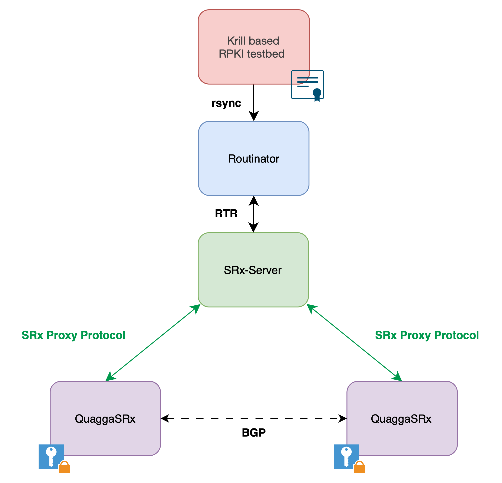
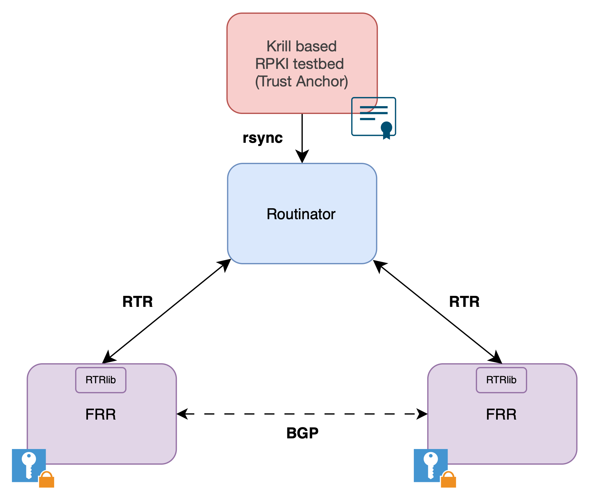
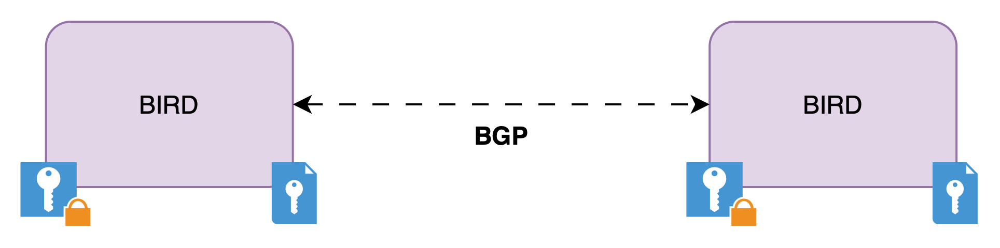
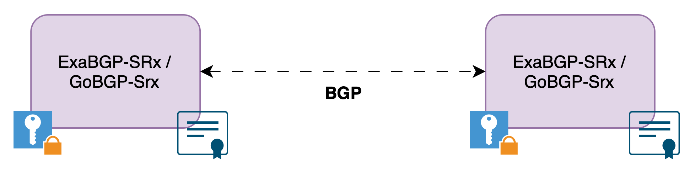
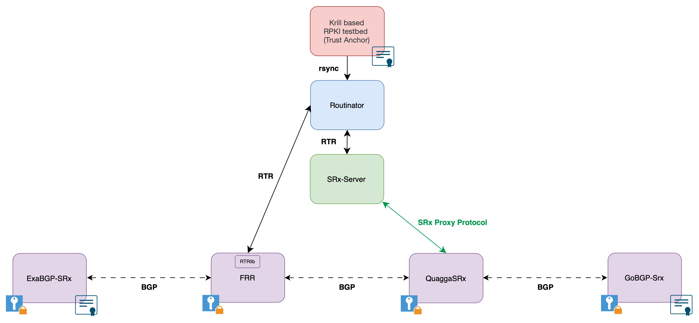

# BGPsec testbed

This repository contains everything necessary to run 2- and 4-router topologies with the currently available routers supporting BGPsec. 
This README includes more information on the repository and documentation on how to start the topologies. 
For more information on the current state of BGPsec implementations please refer to our blog: [BGPsec - Could you run it if you wanted to?](https://www.sidnlabs.nl/en/news-and-blogs/bgpsec-could-you-run-it-if-you-wanted-to)

> [!CAUTION]
> This software is experimental and not meant to be used in production. Use this software at your own risk.


## Directory layout
```
.
├── README.md
├── docker_images
│   ├── bird
│   ├── exabgpsrx
│   ├── frr
│   ├── gobgpsrx
│   ├── quaggasrx
│   ├── srx_server
│   └── tal_share
├── docs
├── key_setup
│   ├── bgpsec_openssl.cnf
│   ├── create_certificates.sh
│   └── topology_asns
└── topologies
    ├── configs
    ├── four_routers
    ├── scripts
    └── two_routers
```


| Directory/File                                    | Description                                                                                                                                                                                                |
| ------------------------------------------------- | ---------------------------------------------------------------------------------------------------------------------------------------------------------------------------------------------------------- |
| `bgpsec-testbed/docker_images/`                   | Dockerfiles for the five router implementations, for the SRx-Server and for `tal_share`.                                                                                                                       |
| `bgpsec-testbed/docker_images/tal_share`          | This image allows sharing the TAL created by Krill with Routinator. This setup is inspired by [krill-e2e-testbed](https://github.com/NLnetLabs/rpki-deploy/tree/main/terraform/krill-e2e-test) by NLnet Labs. |
| `bgpsec-testbed/docs/`                            | Topology diagrams for the different setups.           
| `bgpsec-testbed/key_setup/bgpsec_openssl.cnf`     | Configuration file for OpenSSL. Sets `extendedKeyUsage = id-kp-bgpsec-router` in a signing request.                                                                                                                             |
| `bgpsec-testbed/key_setup/create_certificates.sh` | Creates private keys, public keys and matching BGPsec router certificates for a file with a list of ASNs (one per line) that is passed to it.                                                                     |
| `bgpsec-testbed/key_setup/topology_asns`          | List of ASNs required for the testbed topologies.                                                                                                                                                          |
| `bgpsec-testbed/topologies/configs`               | Configuration files for routers and all other components.                                                                                                                                                  |
| `bgpsec-testbed/topologies/four_routers`          | docker-compose file for a topology with four routers.                                                                                                                                                      |
| `bgpsec-testbed/topologies/scripts`               | Script to add BGPsec router certificates to Krill.                                                                                                                                                         |
| `bgpsec-testbed/topologies/two_routers`           | docker-compose files for topologies with two routers.                                                                                                                                                      |


## Running
### Requirements
- [Docker](https://docs.docker.com/engine/install/) (tested with version 28.0.1)
- [Docker Compose](https://docs.docker.com/compose/install/) (tested with version v2.33.1)
- [OpenSSL](https://openssl-library.org) (tested with version 3.0.13)

### Setting Up
To run the testbed topologies it is necessary to create keys and BGPsec router certificates. Navigate to the `bgpsec-testbed/key_setup` folder and run the `create_certificates.sh` script to do so. 
The script expects a file with a list of ASNs. `topology_asns` contains all ASNs required for the testbed topologies.

```
user@bgpsec:~/bgpsec-testbed/key_setup$ ./create_certificates.sh topology_asns 
read EC key
writing EC key
read EC key
writing EC key
Certificate request self-signature ok
subject=CN = ROUTER-0000FC5A
read EC key
writing EC key
read EC key
writing EC key
Certificate request self-signature ok
subject=CN = ROUTER-0000FC5B
read EC key
writing EC key
read EC key
writing EC key
Certificate request self-signature ok
subject=CN = ROUTER-0000FC5C
read EC key
writing EC key
read EC key
writing EC key
Certificate request self-signature ok
subject=CN = ROUTER-0000FC5D
The following ASN-SKI pairs were created. All configuration files necessary for the testbed topologies were adapted. In case further configuration files were added, please update the SKIs manually.
64602-SKI: DE1EC8580A6D895E71A23A844D210C3F3BE3B017
64603-SKI: 67B8AFAAB21141DBB30AD940383FEA79D9910DA4
64604-SKI: C071605E3D8E5C3BDE83A56CDD7F6D088A549EBF
64605-SKI: 0C172AE5A7436F24BF8DC8A6CCA6BF0243966A11
```

When called, the script generates the required files for each ASN and signs each BGPsec router certificate with a self-signed certificate. 
When running a topology with Krill and Routinator, these signed certificates are replaced by certificates signed by Krill. 

The configuration files for each router required by the topologies are adapted to match the newly created certificates by adding the new SKI to each file. 

All keys and certificates are stored in a folder structure that complies with the local key store format required by NIST-BGP-SRx (`testbed_keys`) as well as the format expected by the BIRD implementation (`bird_testbed_keys`). 
For the sake of simplicity, all private/public keys and certificates are mounted into all router containers (even if the routers receive the certificates via Routinator).

After this step, the topologies can be started.


### Starting
Navigate to one of the topology directories containing a `docker-compose.yml` and start the containers.
```
user@bgpsec:~/bgpsec-testbed/topologies/four_routers$ docker compose up 
[+] Running 11/11
 ✔ Network four_routers_bgp  Created
 ✔ Container rsyncd          Created
 ✔ Container krill           Created
 ✔ Container krillc          Created
 ✔ Container tal_share       Created
 ✔ Container routinator      Created
 ✔ Container srx_server      Created
 ✔ Container quaggasrx       Created
 ✔ Container gobgpsrx        Created
 ✔ Container frr             Created
 ✔ Container exabgpsrx       Created
Attaching to exabgpsrx, frr, gobgpsrx, krill, krillc, quaggasrx, routinator, rsyncd, srx_server, tal_share
```

### Announcing (additional) prefixes
GoBGP-SRx does not allow announcing a prefix by configuring it in the configuration file. A prefix can be manually announced like this:

```
user@bgpsec:~/bgpsec-testbed$ docker exec -it gobgpsrx_one gobgp global rib add 10.2.0.0/16 bgpsec
+++ bgpsec configuration found 
+++++++++ BGPSec called +++++++++++++
```


### Observing
One way of analysing updates exchanged in the topology is using tcpdump and listening on the `br-bgp` bridge.
```
user@bgpsec:~/bgpsec-testbed$ sudo tcpdump -i br-bgp -w test.pcap
```


## Topologies

### Two router topologies
For interoperability testing, we configured a topology for every possible combination of two router implementations.
If required, the topology also contains a Krill, Routinator, rsyncd and `tal_share` container. If QuaggaSRx is used, SRx-Server is configured as well.

| Setup QuaggaSRx    | Setup FRR   | Setup BIRD | Setup ExaBGP-SRx/GoBGP-SRx |
| -------------------------- | ------------------- | --------------------------------------- | --------------- |
|  |  |    |    |


### Four router topology
The four router topology contains all router implementations except for BIRD. We ran into too many issues with BIRD when testing interoperability, which is why it is not part of this topology. The four routers are chained after each other in this example topology.

